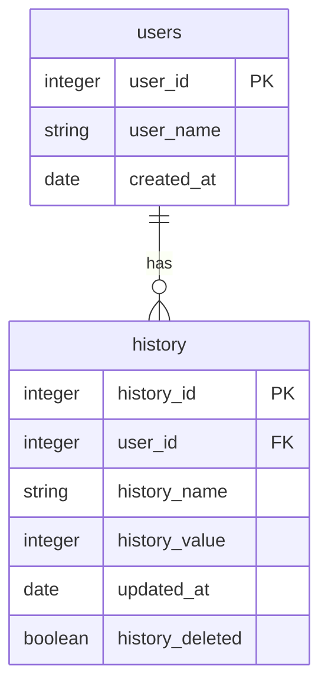

# 🏆 Core Utility App (CUA)  
This repository hosts the development of the Core Utility App (CUA). The CUA is designed to be a robust, highly optimized, and cross-platform  desktop/mobile utility application. It serves as a proof-of-concept demonstrating mastery of advanced PyQt6 development practices, including the Observer Pattern (Signals/Slots), robust architectural patterns (Repository Pattern), and asynchronous processing.  


  
The CUA is not just a calculator; it is a template for building professional, maintainable, and scalable GUI applications that adhere to industry  best practices.

# ✨ Features (Current Status)  
The current iteration of the CUA successfully establishes a fully responsive and functional core utility widget system:  
* __Responsive UI__: Utilizes QVBoxLayout, QHBoxLayout, and QGridLayout to ensure the interface remains flawless and adapts perfectly across  varying screen sizes.  
* __Component Integrity__: Correct use of core PyQt widgets (QLabel, QPushButton, QLineEdit) ensuring optimal user interaction.  
* __Signal-Slot Architecture__: The core functionality (counting/calculating) is completely decoupled from the UI. Button clicks emit Signals, and  separate, clean Slots handle the logic and UI updates, demonstrating advanced architectural understanding.

# 🔬 Technical Stack & Architecture  

<table>
    <thead>
        <tr>
            <th>Component</th>
            <th>Technology</th>
            <th>Purpose</th>
            <th>Demonstrated</th>
        </tr>
    </thead>
    <tbody>
        <tr>
            <td>Primary Language</td>
            <td>Python 3.x</td>
            <td>Core Programming Language</td>
            <td>Clean, Object Oriented(OO) implementation</td>
        </tr>
        <tr>
            <td>GUI Framework</td>
            <td>PyQt6</td>
            <td>The robust toolkit for desktop/mobile UI</td>
            <td>Expertise in widget life cycles and signal handling</td>
        </tr>
        <tr>
            <td>Design Pattern</td>
            <td>Observer Pattern</td>
            <td>Using Signals/Slots for communication</td>
            <td>Achieving robust decoupling</td>
        </tr>
        <tr>
            <td>Architectural Goal</td>
            <td>Repository Pattern</td>
            <td>Separating data access logic from the UI logic</td>
            <td>Scalability and Testability</td>
        </tr>
        <tr>
            <td>Design Language</td>
            <td>Qt Style Sheets(.qss)</td>
            <td>Applying consistent, professional styling</td>
            <td>Polish and professional aesthetic finishing</td>
        </tr>
    </tbody>
</table>

# 🔧 Installation & Setup  
To run the current iteration of the Core Utility App, follwo these steps:  
1.  __clone the Repository:__
```bash  
git clone https://github.com/DGashaw/Core-Utility-App.git  
cd Core-Utility-App  
```  
2. __Create a Virtual Enviroment (Highly Recommended):__  
```bash  
python3 -m venv env  
source env/bin/activate  #On Windows OS: env\Scripts\activate  
```  
3. __Install Dependencies:__  
The project requires __PyQt6__ and standard __Python__ libraries  
```bash  
pip install -r requirements.txt  
```  
4. __Run the Application:__  
```bash  
python main.py  
```  
# 🔭 Roadmap & Future Development Goals  
The CUA is designed to grow through subsequent phase development. The following features are planned to showcase a full mastery of mobile   application development:  
## 💾 Phase 2: Data Persistence & Reliability  
* __Goal:__ ITurn the counter into persistent __Memory Trucker__  
* __Concepts:__ Implementing ```sqlite3``` for local data storage  
* __Enhancements:__ Users can save the current counter state and retrieve it upon restarting the applications, validating data inputs against  structural database model  
## 🌐 Phase 3: Networking & Asynchronicity (The Mobile Touch)  
* __Goal:__ Integrate external data fetching(e.g., calculating unit costs based on external exchange rates or fetching pre-set widget themes)  
* __Concepts:__ Utilizing ```QThread``` and Signals for safe, non-blocking API calls  
* __Enhancements:__ The app will display a loading state/spinner while fetching data, ensuring the UI never freezes, demonestrating the importance of asynchronous programming  
## 💎 Phase 4: Optimization & Professional Polish (Production Ready Application)  
* __Goal:__ Finalize the app, optimizing performance and making it production ready  
* __Concepts:__  Implementing the __Repository Pattern__ fully, ensuring all data interation flows throw a single layer. Unit testing the undrlying 
business logic  
* __Deliverable:__ A fully styled, highly robust application suitable for compilation and distribution on multiple platforms  

# 🤝 Contribution & Testing  
* __Testing:__ The architecture is designed to be unit-testable. Tests for the __Service Layer__ (e.g., testing the logic 
that calculates the final score, regardless of the UI)  
* __Contribution:__ Feel free to suggest improvements, especially regarding new features or optimized UI flows. We are using the best practices: 
all major logic must reside in the __Model/Service Layer__, never directly in the UI code  

# 🗄️ Core Utility App - CUA Data Model  


# Final Words  
The app is developed with 🔥 PyQt6 and Professional Architecture Principles.
